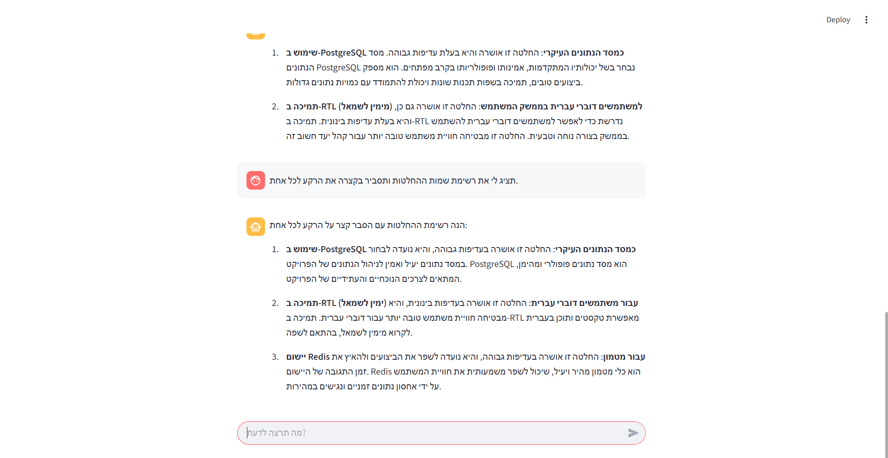

:

---
# עוזר פרויקט חכם: Agentic RAG & Data Extraction

מערכת בינה מלאכותית מתקדמת המבוססת על **LlamaIndex** ו-**Cohere**, שנועדה לנהל ולתחקר החלטות טכניות של פרויקט. המערכת משלבת אחזור מידע ממסמכים (RAG), חילוץ נתונים מובנים ל-JSON, וסוכן (Agent) חכם המנווט בין מקורות המידע.

##  מבט על ממשק המערכת

הממשק נבנה באמצעות **Streamlit** ומציג את האינטראקציה של הסוכן עם המשתמש בזמן אמת.


### מה רואים בממשק?

* **צ'אט אינטראקטיבי:** מענה לשאלות בשפה חופשית (עברית/אנגלית).
* **לוגיקת Agentic:** הצגת תהליך ה-"מחשבה" של הסוכן (Thought) והכלים שבהם בחר להשתמש.
* **שילוב נתונים:** הצגת מידע טקסטואלי מפורט לצד סיכומים כמותיים מתוך ה-JSON.

---

##  עמידה מלאה בדרישות הפרויקט

המערכת מיישמת את כל סעיפי המטלה:

* **LlamaIndex & Cohere:** שימוש ב-LLM (`command-r`) וב-Embeddings של Cohere לאינדוקס ושאילתות.
* **Agentic System:** בניית סוכן מבוסס `ReAct` המפעיל כלים באופן אוטונומי.
* **Structured Data Extraction:** חילוץ נתונים אוטומטי מ-Markdown ל-JSON באמצעות Pydantic Schema.
* **Event-Driven Workflow:** ניהול תהליך שליפה ואימות מידע מבוסס אירועים (Events).
* **Multi-Tool Usage:** ניתוב חכם בין כלי חיפוש סמנטי (RAG) לכלי נתונים מובנים (JSON).

---

##  ארכיטקטורה ומבנה קבצים

1. **`ingest_data.py`**: טעינת מסמכי המקור, הפיכתם לוקטורים ושמירתם בתיקיית `storage`.
2. **`data_extraction.py`**: חילוץ ישיר של החלטות טכניות לתוך `extracted_data.json` בפורמט מובנה.
3. **`rag_workflow.py`**: ניהול זרימת העבודה (Workflow) של המערכת באמצעות אירועים.
4. **`agent_system.py`**: הגדרת ה-Agent והכלים העומדים לרשותו:
* `documentation_search`: כלי לחיפוש סמנטי במסמכים.
* `structured_data_viewer`: כלי לקריאת נתוני ה-JSON.


5. **`app.py`**: ממשק המשתמש הגרפי.

---

## הוראות הפעלה

### 1. התקנת ספריות

```bash
pip install llama-index llama-index-llms-cohere llama-index-embeddings-cohere streamlit pydantic python-dotenv

```

### 2. הגדרת מפתח API

צרו קובץ `.env` בתיקייה הראשית והוסיפו:

```env
COHERE_API_KEY=המפתח_שלכם_כאן

```

### 3. הרצת ה-Pipeline

כדי לעדכן את המערכת בהחלטות חדשות, יש להריץ לפי הסדר:

1. `python ingest_data.py`
2. `python data_extraction.py`
3. `streamlit run app.py`

